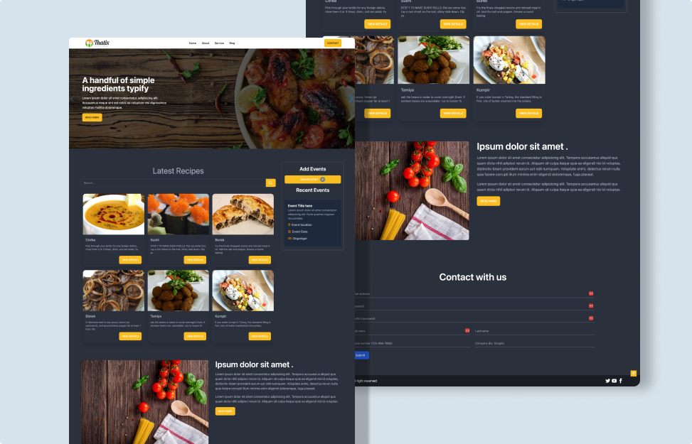

# Food Blogger's Event Calendar

Welcome to the Food Blogger's Event Calendar project! This is a web application designed for food blogging enthusiasts to organize and manage their events seamlessly. Whether you're hosting cooking classes, food tastings, or culinary workshops, this platform provides a user-friendly interface to plan and share your events.

<h1 align="center">Project Overview</h1>

The Food Blogger's Event Calendar is a single-page web application built using HTML, CSS (including Tailwind CSS and Daisy UI), and JavaScript. The project aims to offer an intuitive and visually appealing platform for food bloggers to showcase their upcoming events and engage with their audience.

## Key Features

- **Event Creation**: Users can easily create new events, providing details such as event name, date, time, location, and description.
- **Event Display**: The calendar dynamically displays upcoming events, allowing users to view event details with a simple click.
- **Interactive Elements**: Users can interact with the calendar, such as filtering events by date or searching for specific events.

- **Dynamic DOM Manipulation**: JavaScript is utilized to dynamically update the DOM, providing a responsive and interactive user experience.

## Project Structure

- **index.html**: Main HTML file containing the structure of the single-page application.
- **style.css**: CSS file for custom styling, incorporating Tailwind CSS and Daisy UI for design consistency.
- **app.js**: JavaScript file containing the logic for event handling, form processing, and DOM manipulation.

- **images/**: Directory for storing images, icons, or any other static assets used in the project.

## Usage

To run the Food Blogger's Event Calendar locally, simply open the `index.html` file in a web browser. Alternatively, the project is hosted on GitHub Pages for easy access and sharing.

## Contributing

Contributions to the project are welcome! If you have any suggestions for improvements or would like to report any issues, feel free to submit a pull request or open an issue on GitHub.

---

Thank you for checking out the Food Blogger's Event Calendar project! We hope it helps food bloggers around the world better organize and promote their culinary events. If you have any questions or feedback, don't hesitate to reach out. Happy blogging!
